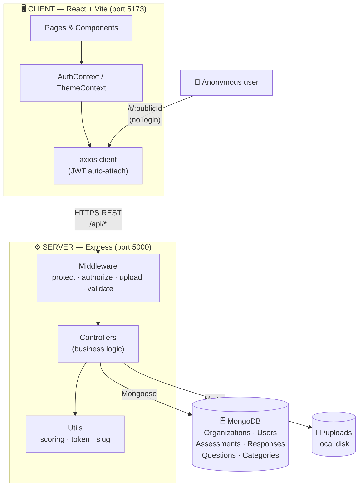
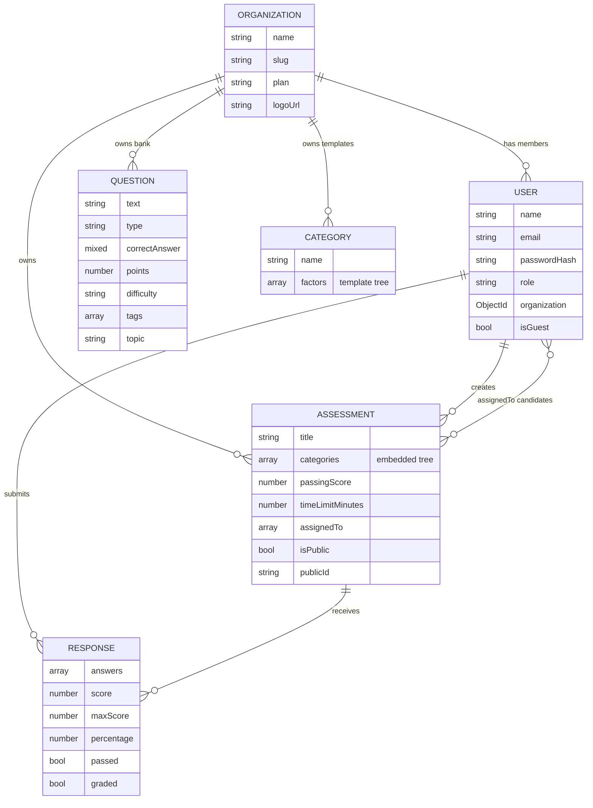
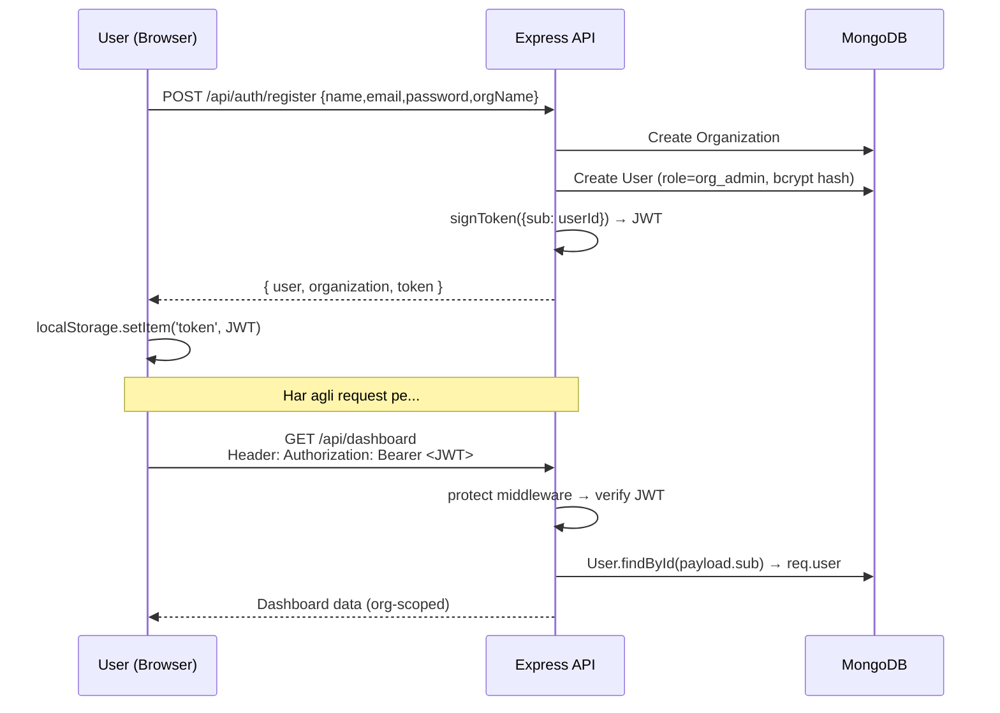
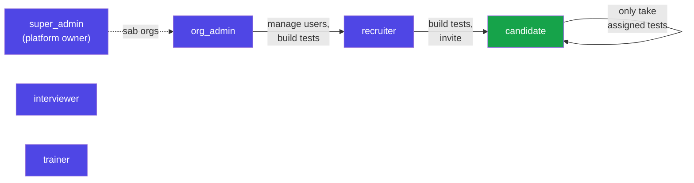
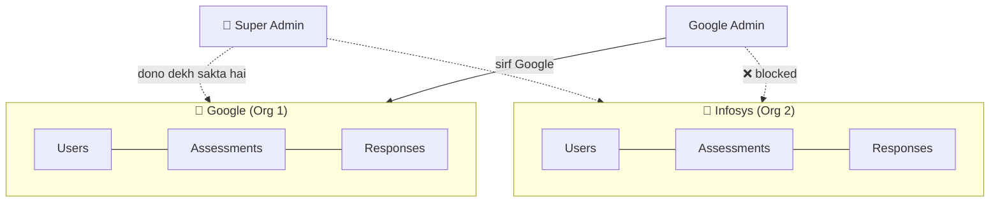
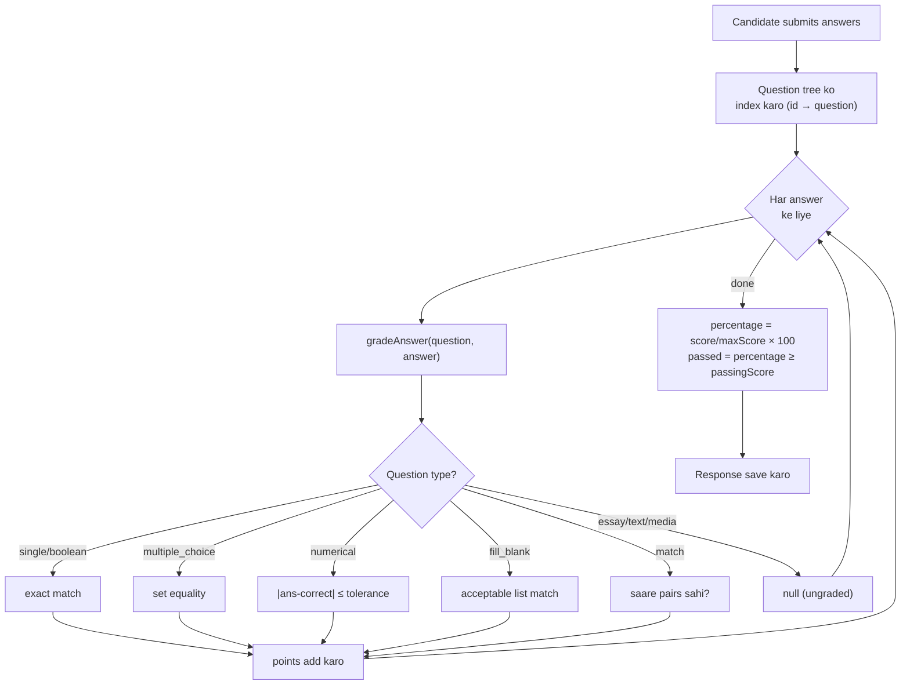
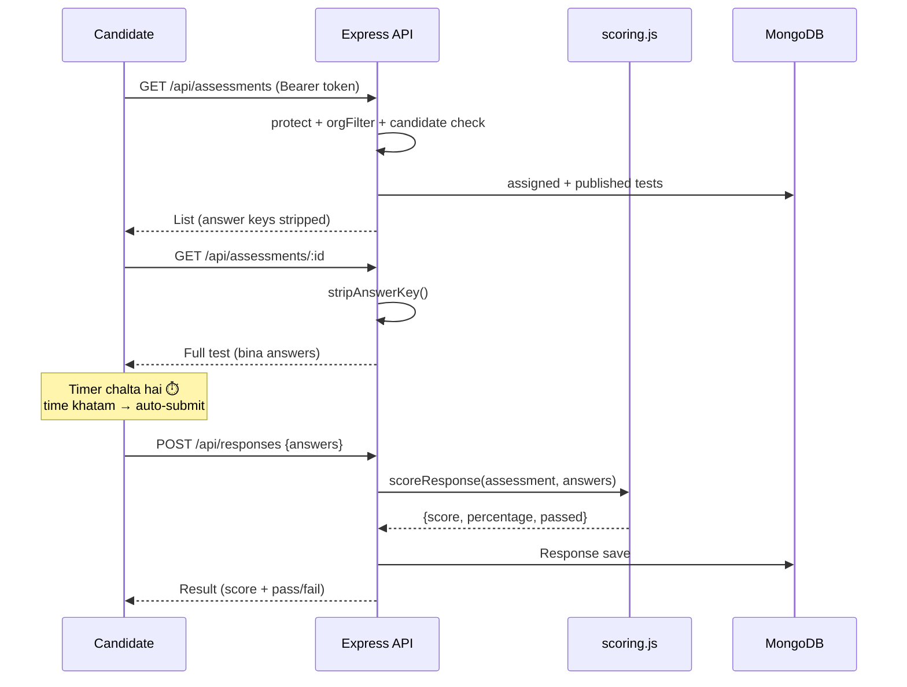
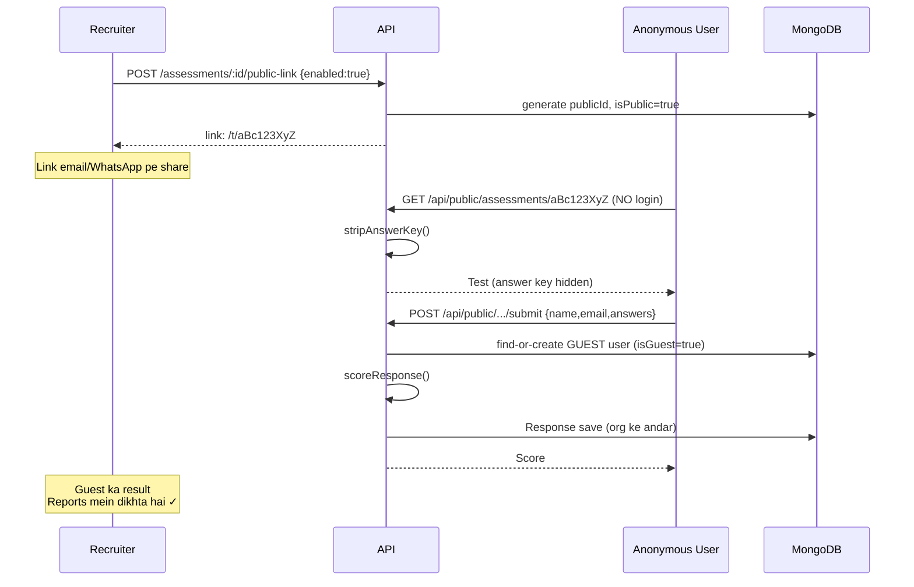

# 🎯 Kongu — Assessment SaaS Platform · Interview & Demo Guide

> Ek complete guide taaki aap ye project interview mein **confidently explain aur demo** kar sako.
> Har diagram **Mermaid** mein hai — VS Code (Markdown Preview) ya GitHub pe automatically render hota hai.

---

## 📑 Index
1. [Project kya hai (Pitch)](#1-project-kya-hai)
2. [Tech Stack](#2-tech-stack)
3. [System Architecture (Diagram)](#3-system-architecture)
4. [Folder Structure](#4-folder-structure)
5. [Data Model / ER Diagram](#5-data-model--er-diagram)
6. [Authentication + JWT flow](#6-authentication--jwt-flow)
7. [RBAC (Roles & Permissions)](#7-rbac--roles--permissions)
8. [Multi-Tenancy (Org scoping)](#8-multi-tenancy)
9. [Scoring Engine](#9-scoring-engine)
10. [Request Lifecycle (Sequence Diagrams)](#10-request-lifecycle)
11. [Public Link flow (Module 14)](#11-public-link-flow)
12. [Saare Modules](#12-saare-modules)
13. [API Endpoints Reference](#13-api-endpoints-reference)
14. [Demo Script (step-by-step)](#14-demo-script)
15. [Interview Q&A](#15-interview-qa)
16. [App kaise chalayein](#16-app-kaise-chalayein)

---

## 1. Project kya hai

**Kongu** ek **multi-tenant SaaS assessment platform** hai — jaise HackerRank, Mercer Mettl, ya TestGorilla.

> **Elevator pitch:** "Organizations (companies) apne recruiters aur candidates ko manage karti hain, scored assessments banati hain 12+ question types ke saath, candidates test dete hain, system auto-grade karta hai, aur real-time analytics + dashboards deta hai. Anonymous candidates public link se bhi test de sakte hain."

**Problem it solves:** Manual hiring/training assessments slow aur unstructured hote hain. Ye platform pura flow automate karta hai:

```
Organization → Admin → Recruiter → Candidate → Assessment → Auto-Evaluation → Analytics
```

---

## 2. Tech Stack

| Layer | Technology | Kyun |
|---|---|---|
| **Frontend** | React 18 + Vite | Fast dev server, component-based UI |
| **Routing** | React Router v6 | SPA navigation, role-based routes |
| **State** | Context API | Lightweight (Redux ki zarurat nahi thi) |
| **Backend** | Node.js + Express | REST API, middleware pattern |
| **Database** | MongoDB + Mongoose | Flexible schema, nested documents |
| **Auth** | JWT + bcrypt | Stateless auth, secure passwords |
| **Uploads** | Multer | File/audio/video answers |
| **Testing** | Node test runner + Supertest + in-memory Mongo | 23 integration tests |

---

## 3. System Architecture



**Interview line:** "Client aur Server bilkul decoupled hain — REST API se baat karte hain. Server stateless hai (JWT), toh horizontally scale ho sakta hai."

---

## 4. Folder Structure

```
Kongu/
├── client/src/
│   ├── pages/          Login, Register, Dashboard, Builder, Bank,
│   │                   Assessments, LaunchPad, Reports, Team,
│   │                   CandidatePortal, PublicAssessment
│   ├── components/     Navbar, RoleRoute, QuestionEditor, AnswerInput,
│   │                   QuestionSettingsModal, LoadBankModal, LoadCategoriesModal
│   ├── context/        AuthContext (user+token), ThemeContext (dark/light)
│   ├── constants/      roles.js (client role mirror + helpers)
│   └── api/client.js   axios instance + JWT interceptor
│
└── server/src/
    ├── models/         Organization, User, Category, Assessment, Response, Question
    ├── controllers/    auth, organization, user, dashboard, category,
    │                   question, assessment, response, public
    ├── routes/         har resource ka router
    ├── middleware/     auth.js (JWT), rbac.js (roles), upload.js (multer),
    │                   error.js, validate.js
    ├── utils/          scoring.js, token.js, slug.js, seed.js
    └── config/         db.js, roles.js
```

**Design pattern:** `Route → Middleware → Controller → Model → DB`. Controllers thin, logic utils mein reusable.

---

## 5. Data Model / ER Diagram



### Assessment ka andar ka structure (nested tree):
```
Assessment
 └── categories[]          (e.g. "JavaScript Fundamentals")
      └── factors[]        (e.g. "Core Language")
           └── questions[] (text, type, options, correctAnswer, points, ...)
```

### 🔑 2 Smart Design Decisions (interview mein zaroor bolo)

**1. Embedded vs Referenced questions:**
> "Assessment ke andar question tree **embedded** hai. Kyun? Agar main question template baad mein edit karoon, toh jo tests already launch ho chuke, unke questions change nahi hone chahiye — snapshot ban jaata hai. Data integrity."

**2. Answer denormalization:**
> "Response ke andar har answer ke saath question ka text/type/category bhi copy hota hai. Toh Reports dikhate waqt pura assessment tree dobara traverse nahi karna padta — fast reads."

---

## 6. Authentication + JWT flow



**Key points:**
- Password kabhi plain store nahi hota → **bcrypt** (10 salt rounds)
- `toJSON()` method response se `passwordHash` strip kar deta hai
- Token `localStorage` mein, axios interceptor har request pe auto-attach karta hai
- **Register = naya organization banana** (signer org_admin ban jaata hai). Baaki users org_admin invite karta hai.

---

## 7. RBAC — Roles & Permissions



**Kaise enforce hota hai:**
```js
// Route level:
router.post('/', protect, authorize('org_admin','recruiter'), createAssessment)
//                  ↑ JWT valid?   ↑ role allowed?           ↑ tabhi controller chalega

// authorize() middleware:
export function authorize(...allowed) {
  return (req, res, next) => {
    if (req.user.role === 'super_admin' || allowed.includes(req.user.role)) return next();
    res.status(403); throw new Error('Forbidden: insufficient role');
  };
}
```

**Frontend pe:** `RoleRoute` component — candidate agar `/dashboard` kholne ki koshish kare toh apne portal pe redirect ho jaata hai. Navbar bhi role ke hisaab se alag links dikhata hai.

**Test se prove kiya:** "Candidate `/api/assessments` POST kare toh **403** milta hai — maine iska test likha hai."

---

## 8. Multi-Tenancy

> **Interview ka favorite question: "Ek company ka data dusri se isolate kaise?"**

Har `User`, `Assessment`, `Response`, `Question` mein `organization` field hai. Har query ek helper se scope hoti hai:

```js
// middleware/rbac.js
export function orgFilter(req) {
  if (req.user.role === 'super_admin') return {};          // cross-org access
  return { organization: req.user.organization };          // sirf apna org
}

// Controller mein use:
const assessments = await Assessment.find(orgFilter(req));  // auto org-scoped
```



---

## 9. Scoring Engine

`server/src/utils/scoring.js` — dil hai poore platform ka.



**Grading logic har type ke liye:**
| Type | Kaise grade hoti hai |
|---|---|
| single_choice / boolean | Exact match (case-insensitive) |
| multiple_choice | Order-independent set equality |
| numerical | `|answer − correct| ≤ tolerance` |
| fill_blank | Acceptable answers list mein match (e.g. "color"/"colour") |
| match | Saare left→right pairs correct |
| essay, text, media | Ungraded (Phase 3 mein AI evaluate karega) |

**🔒 Security detail (bolo — impress karega):**
> "`stripAnswerKey()` function candidate ko assessment bhejte waqt har question ka `correctAnswer` remove kar deta hai. Toh browser ke Network tab mein answers leak nahi hote. Maine test se verify kiya."

---

## 10. Request Lifecycle

### Example: Candidate ek test deta hai



---

## 11. Public Link flow (Module 14)



**Smart part:** "Guest ke liye ek lightweight `isGuest` user auto-create hota hai, taaki uska result staff ke Reports/analytics mein normally dikhe — koi special case nahi."

---

## 12. Saare Modules

### Phase 1 — Foundation ✅
| Module | Kya karta hai |
|---|---|
| M1 Multi-Org | Har company alag tenant |
| M2 RBAC | 6 roles, permission-based access |
| Scoring Engine | Auto-grading |
| M3 Dashboard | KPI cards, top categories chart, recent activity |
| M4 Candidate Portal | Candidate apne tests + results dekhta hai |

### Phase 2 — Assessment Power ✅
| Module | Kya karta hai |
|---|---|
| M11 Timer | Countdown + auto-submit |
| M12 Question Types | 13 types (MCQ, numerical, fill-blank, match, essay, file, audio, video, image...) |
| File Upload | Multer se media answers |
| M8 Question Bank | Reusable questions, tags/difficulty/topic, randomization |
| M9 Drag-Drop Builder | Categories/factors/questions reorder |
| M14 Public Links | Anonymous test-taking |

### Pending (honesty se bolo)
- M13 Email Invites (SMTP chahiye)
- Phase 3: AI (Claude API — question generator, evaluation, insights)
- Phase 4-5: Coding runner, proctoring, certificates, payments, integrations, mobile

---

## 13. API Endpoints Reference

| Method | Endpoint | Access | Kaam |
|---|---|---|---|
| POST | `/api/auth/register` | public | Naya org + admin |
| POST | `/api/auth/login` | public | Login → JWT |
| GET | `/api/auth/me` | auth | Current user + org |
| GET | `/api/dashboard` | staff | KPIs |
| GET/POST/PUT/DELETE | `/api/users` | admin | Team management |
| GET/POST/PUT/DELETE | `/api/questions` | staff | Question Bank |
| GET | `/api/questions/random` | staff | Random pull |
| GET/POST/PUT/DELETE | `/api/assessments` | staff (read: all) | Assessments |
| POST | `/api/assessments/:id/public-link` | staff | Share link toggle |
| POST | `/api/responses` | auth | Submit + auto-grade |
| GET | `/api/responses` | auth | Reports (staff: org, candidate: own) |
| POST | `/api/uploads` | auth | File upload |
| GET | `/api/public/assessments/:publicId` | **public** | Anonymous fetch |
| POST | `/api/public/assessments/:publicId/submit` | **public** | Anonymous submit |

---

## 14. Demo Script

**App chalao:**
```bash
# Terminal 1:
cd server && PORT=5077 JWT_SECRET=dev-secret node dev-local.mjs
# Terminal 2:
cd client && npm run dev
```
> Note: agar `VITE_API_TARGET` set nahi hai toh client port 5000 pe proxy karta hai. Isliye demo ke liye backend default port (5000) pe chalao, ya `client` mein `VITE_API_TARGET=http://localhost:5077` set karo.

**Logins (password sab ka `demo1234`):**
`admin@demo.com` · `recruiter@demo.com` · `candidate@demo.com` · `super@demo.com`

**5-minute demo:**
1. **Admin login** → Dashboard (KPI cards, charts) — "real-time org analytics"
2. **Team** page → naya candidate add karo, role assign — "RBAC live"
3. **Question Bank** → difficulty/tag se filter — "reusable pool + randomization"
4. **Builder** → assessment banao → questions **drag-reorder** → "Add from Bank" → correct answers + points + passing score + timer set → Save
5. **Assessments** → "🔗 Share link" → link copy
6. **Incognito tab** → public link kholo → naam daalo → test do (⏱️ timer chalta) → submit → **instant score + pass/fail**
7. **Wapas Admin** → Reports mein guest ka result ✓/✗ ke saath

---

## 15. Interview Q&A

**Q: JWT vs Session?**
> Stateless — server ko session store nahi rakhna. Koi bhi server instance token verify kar sakta hai → scalable.

**Q: Password security?**
> bcrypt hashing (salt 10 rounds), plain kabhi store nahi, response se strip.

**Q: Multi-tenancy?**
> `organization` field + `orgFilter()` har query pe. Super admin ko empty filter.

**Q: Embedded vs referenced data kab use kiya?**
> Assessment questions embedded (snapshot immutability), Users/Orgs referenced (relationships).

**Q: Testing strategy?**
> 23 integration tests, Supertest + in-memory MongoDB. Auth, RBAC 403s, scoring, all question types, uploads, public links covered.

**Q: File upload kaise?**
> Multer, local disk storage, static serving. Production mein S3/Cloudinary pe swap ho sakta hai (interface same).

**Q: Answer leak kaise prevent kiya?**
> `stripAnswerKey()` — candidate ko correctAnswer bhejte hi nahi.

**Q: Frontend state management Redux kyun nahi?**
> App ki state simple thi (auth + theme). Context API sufficient tha — over-engineering avoid ki.

---

## 16. App kaise chalayein

```bash
# Backend (in-memory DB, auto-seed):
cd server
npm install
PORT=5077 JWT_SECRET=dev-secret node dev-local.mjs

# Frontend:
cd client
npm install
npm run dev          # http://localhost:5173

# Tests:
cd server && npm test   # 23 tests
```

**Seed data:** ek "Demo Org", 4 users (har role), ek scored assessment (30-min timer), aur 5 bank questions.

---

*Bana hua: MERN stack · JWT auth · RBAC · Multi-tenant · Auto-scoring · 23 tests passing*
